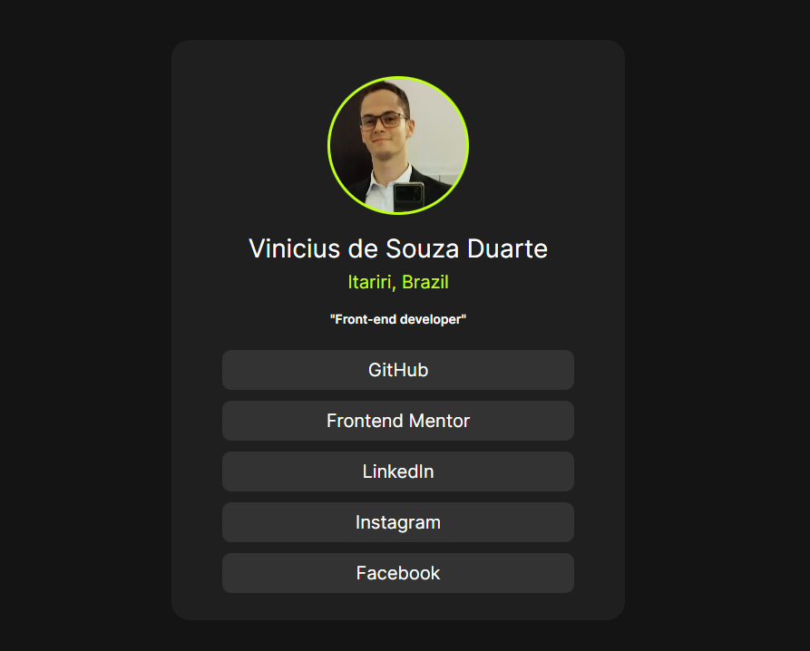

# Frontend Mentor - Social links profile solution

This is a solution to the [Social links profile challenge on Frontend Mentor](https://www.frontendmentor.io/challenges/social-links-profile-UG32l9m6dQ). Frontend Mentor challenges help you improve your coding skills by building realistic projects. 

## Table of contents

- [Overview](#overview)
  - [The challenge](#the-challenge)
  - [Screenshot](#screenshot)
  - [Links](#links)
- [My process](#my-process)
  - [Built with](#built-with)
  - [What I learned](#what-i-learned)
  - [Continued development](#continued-development)
  - [Useful resources](#useful-resources)
- [Author](#author)

## Overview

Another project challenged by Frontend Mentor! This project is about a card with links to social media...a used the same template but changed to my informations

### The challenge

Users should be able to:

- See hover and focus states for all interactive elements on the page

### Screenshot

### Links

- Solution URL: [GitHub](https://frontend-mentor-social-link-files.vercel.app/)
- Live Site URL: [Vercel](https://frontend-mentor-social-link-files.vercel.app/)

## My process

### Built with

- Semantic HTML5 markup
- CSS custom properties
- Flexbox

### What I learned

I learned how to visualize wich dimension of width I must apply in order to achieve the result...I started using `width: %;`, however when I had to make it responsive, it was totally a mess...the card was adapting to screensize, then I changed it to rem.

### Continued development

One more step closer to my dream of becoming a fullstack

### Useful resources

- [HTML5](https://developer.mozilla.org/en-US/docs/Web) - Doc.
- [CSS3](https://developer.mozilla.org/en-US/docs/Web/CSS) - Doc.

## Author

- GibHub - [Personal Repository](https://github.com/ViniCellist)
- Frontend Mentor - [Profile](https://www.frontendmentor.io/profile/ViniCellist)
- LinkedIn - [Professional](https://www.linkedin.com/in/viniciussouzaduarte/)

- Instagram - [personal](https://www.instagram.com/vinicius_duartesd/)

